<!--
The CurseForge project description. Kept alongside README.md rather than
generated from it, because the two cannot be identical: this one carries no
badges, no repo-relative links and no mermaid, none of which CurseForge
renders. Everything else should match, so edit both.
-->

# Cooldown Manager Classic

Retail-style grouped cooldown, charge and buff tracking for World of Warcraft Classic — without the configuration overhead of WeakAuras.

Cooldown Manager Classic recreates the clean, grouped cooldown display of Retail's Cooldown Manager, built on Classic's own APIs. Open the spell picker, drag in the abilities you care about, and it builds the layout for you from Classic spellbook data, cooldowns, charges and auras.

<!-- SCREENSHOT: the four groups in combat, labelled. This is the hero image. -->

## Getting started

Type `/cdmc` to open the spell picker, then drag abilities into the group you want them in. That is the whole setup.

Everything else — position, size, colours, fonts, textures — lives in **Blizzard's Edit Mode**. There is no separate settings window to learn.

<!-- GIF: opening /cdmc and dragging two or three abilities into a group. -->

### Slash commands

`/cdmc`, or the aliases `/cooldownmanager` and `/cdm`.

| Command | What it does |
| --- | --- |
| `/cdmc` | Open the spell picker |
| `/cdmc preset` | Apply the default layout for your class |
| `/cdmc preset list` | List the layouts available to you, including your own saved ones |
| `/cdmc export` / `/cdmc import` | Share a profile as a text string |
| `/cdmc profile` | Manage per-character profiles |
| `/cdmc highlights on` / `off` | Toggle proc highlighting |
| `/cdmc add <spellID>` | Add a spell by ID |
| `/cdmc status` | Print what the addon has detected — useful in a bug report |

## Compatibility

One addon, every Classic branch. Spell data is filtered to the version you are on, so cooldown timers and proc detection stay accurate.

| Version | Supported | Notes |
| --- | --- | --- |
| **Classic Era** (1.15.x) | Yes | Core class cooldowns, procs and rotational abilities |
| **Season of Discovery** | Yes | Rune abilities, modified cooldowns and the extra spell interactions |
| **Burning Crusade Classic** (2.5.x) | Yes | Full support |
| **Mists of Pandaria Classic** (5.5.x) | Yes | New in 0.6.0 — Blizzard Edit Mode, spec-aware class resources |

Season of Discovery features gate themselves off automatically on the flavours that do not have them, so nothing SoD-only ever appears on TBC or MoP.

## Features

### Cooldown groups

Organised, centred rows of icons:

- **Essential** — rotational abilities, charges and your major class spells
- **Utility** — defensives, mobility and support
- **Tracked buffs** — procs, self-buffs, runes and long-duration auras
- **Cooldown bars** — for effects where an icon swipe is hard to read

Each group is moved, resized and styled through Edit Mode.

### Cooldowns and charges

- Reads Classic's spellbook directly — swipes, recharge timers, charge counts and ready states
- **Rank-independent resolution**, so a profile built at level 20 still works at 60: a rank 1 spell ID follows you to the highest rank you know
- Spells you cannot use yet (unlearned ranks, unengraved runes) hide themselves and reappear the moment they become available
- Keybind text read from your action bars, shown on the icon
- **Out-of-range tinting** — an ability that cannot reach your current hostile target turns red, the way Blizzard's own action bars colour it
- **Swipe colours per group** — the cooldown, buff and global-cooldown swipes each take their own colour and opacity in Edit Mode; drop the GCD swipe's alpha to nothing to hide it entirely

### Tracked buffs

One group that renders as icons or as bars:

- Buff bars show icon, name, a draining bar and time remaining
- Permanent auras — stances, aspects, forms — fill their bar instead of sitting empty. A deliberate Classic-specific improvement
- Swipe colour follows Retail's buff templates rather than its cooldown templates

<!-- GIF: buff bars draining, next to the same group rendered as icons. -->

### Cooldown bars

A fourth group with no Retail equivalent:

- Tracks the **effect duration** of defensives and utility abilities
- When the effect ends, the bar shows the recharge, dimmed, until ready
- A ready ability draws an empty bar, so a filled bar always means something is actually running — *Fill When Ready* puts the full bar back if you prefer it
- *Effect and Cooldown* mode mirrors Classic pacing; *Effect Only* matches Retail's simpler behaviour
- Aura matching uses the ability's spell ID, falling back to recharge tracking when the aura uses a different one

<!-- GIF: a defensive firing, the bar draining, then dimming through its recharge. -->

### Class resource bars

An adaptive resource bar that follows your class and spec:

- Combo points, with pip or tick styling
- Maelstrom Weapon on Season of Discovery
- Warlock shards — and on Mists, the resource your spec actually uses: Soul Shards, Demonic Fury or Burning Embers
- Health and power bars, with LibSharedMedia textures, borders and colour pickers

### Proc and reactive highlighting

- Procs light up the ability they enable — Shadow Trance to Shadow Bolt, Maelstrom Weapon at full stacks
- Reactive abilities arm from the combat log: Overpower after a dodge, Revenge after you avoid, Riposte after a parry
- Blizzard's own spell-activation glow drives tracked icons too
- **Queued next-swing abilities** get their own distinct indicator — Heroic Strike, Cleave, Maul and Raptor Strike sit armed until the swing lands, and now you can see it

### Druids and damage over time

- **Form-aware tracking** — cat, bear, moonkin and caster each show only what applies, with untagged abilities always visible
- Player-applied DoTs on your target drive cooldown bars (Moonfire, Sunfire); other people's casts are ignored
- Includes abilities whose effect is named differently to the spell, such as a Death Knight's Icy Touch and Plague Strike
- DoT spells with no cooldown are tracked across the existing groups

### Presets and profiles

- Class layouts to start from, and you can save your own
- Per-character profiles, copied, renamed and switched at will
- Full import and export as a text string

## Roadmap

```mermaid
flowchart LR
    subgraph shipped["Shipped in 0.6.0"]
        direction TB
        A1["Cooldown, charge<br/>and buff tracking"]
        A2["Cooldown bars"]
        A3["Class resource bars"]
        A4["Edit Mode settings"]
        A5["Presets and profiles"]
        A6["Proc and reactive<br/>highlighting"]
        A7["Queued next-swing<br/>indicator"]
        A8["TBC and MoP<br/>support"]
    end

    subgraph next["Next"]
        direction TB
        B1["Icon style<br/>options"]
        B2["Right-click menu<br/>on tracked spells"]
        B3["Icon borders and<br/>count fonts"]
        B4["More highlight rules"]
        B5["Resource bar polish"]
    end

    subgraph later["Later"]
        direction TB
        C1["Per-spell<br/>cooldown sounds"]
        C2["Trinket and<br/>consumable tracking"]
        C3["Talent and rune aware<br/>profile switching"]
        C4["First-run welcome<br/>and what's new"]
    end

    shipped --> next --> later
```

**Next**

- Icon style options — zoom, masked or square, desaturation ([#63](https://github.com/fooxytv/CooldownManagerClassic/issues/63))
- A right-click menu on tracked spells, for per-spell actions ([#64](https://github.com/fooxytv/CooldownManagerClassic/issues/64))
- Icon borders and a configurable count/stack font ([#22](https://github.com/fooxytv/CooldownManagerClassic/issues/22))
- More highlight rules, and a panel toggle ([#23](https://github.com/fooxytv/CooldownManagerClassic/issues/23))
- Resource bar polish — stacked ordering, width sync, richer visibility ([#14](https://github.com/fooxytv/CooldownManagerClassic/issues/14))

**Later**

- Per-spell cooldown sounds, once the right-click menu gives them a home ([#64](https://github.com/fooxytv/CooldownManagerClassic/issues/64))
- Trinket and consumable tracking
- Talent and rune aware automatic profile switching
- A first-run welcome, and a what's-new notice after an update ([#41](https://github.com/fooxytv/CooldownManagerClassic/issues/41))

## Bugs and requests

Please raise anything on [GitHub](https://github.com/fooxytv/CooldownManagerClassic/issues). Running `/cdmc status` first and pasting the output into the report saves a round trip — it prints your flavour, interface version and what the addon has detected.
